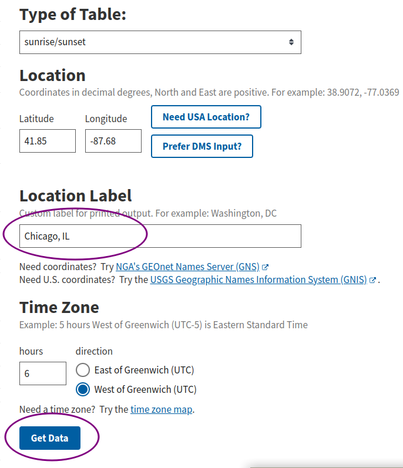
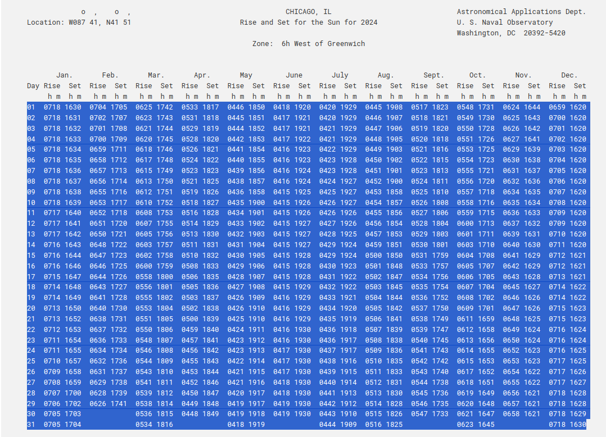
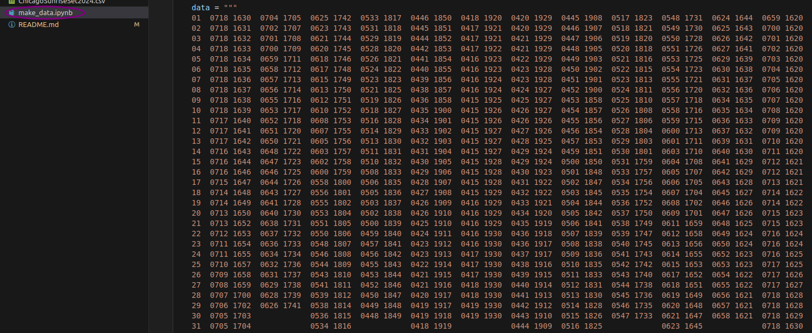
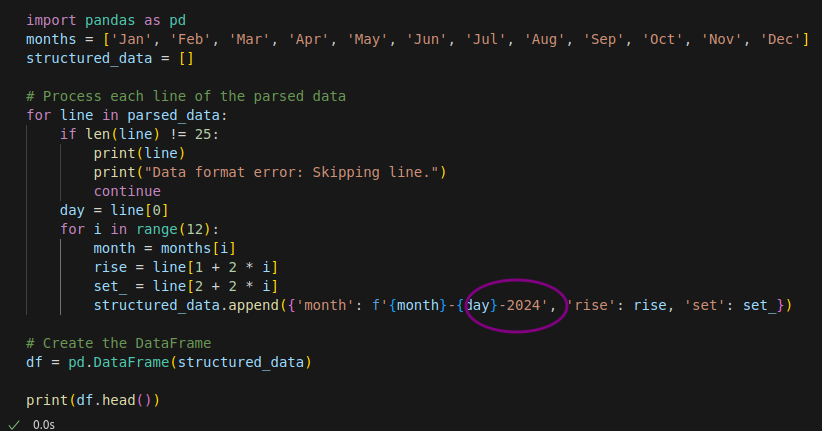

# SunriseSunsetData
Simple Project to Create Sunrise and Sunset Times for each date in a month

### Get raw data
Go to the Atronomical Applications Department for the US Navy 
[https://aa.usno.navy.mil/data/RS_OneYear](https://aa.usno.navy.mil/data/RS_OneYear)
Enter the area you would like the sunrise and sunset data for 
Click "Get Data"  

Copy the Data Table into the code and run the cells to create a dataframe of the sunrise and sunset data 
  

Adjust the year in the code as necessary 

That is all I say good day sir. :-)  
